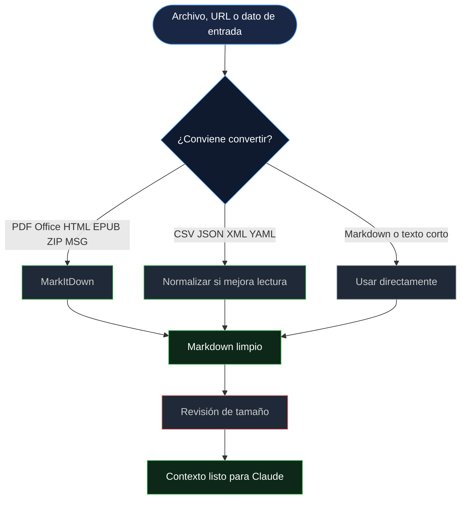

<div align="center">


[](https://python.org)
[](https://daringfireball.net/projects/markdown/)
[](#instalar-en-claude-code)
[](#formatos-soportados)
[](LICENSE)

<br/>

> **MarkItDown Skill convierte documentos en Markdown limpio para Claude.**
> Añade esta skill a Claude Code para que sepa cuándo convertir PDFs, Office, HTML, hojas de cálculo, archivos comprimidos, imágenes, audio y datos estructurados antes de analizarlos.

</div>

---

## Para qué sirve

Claude y otros agentes trabajan mejor con Markdown que con archivos binarios o contenido ruidoso. Esta skill enseña un flujo experto para usar MarkItDown antes de pasar documentos al contexto del modelo.

| Problema | Solución con esta skill |
|----------|--------------------------|
| PDFs, DOCX, XLSX o PPTX no son texto directo | Convertirlos a Markdown estructurado |
| HTML incluye scripts, navegación y etiquetas | Limpiarlo antes de analizarlo |
| Archivos grandes consumen demasiados tokens | Aplicar presupuesto y truncado controlado |
| ZIP, MSG, imágenes o audio necesitan tratamiento especial | Usar reglas de conversión y seguridad |
| CSV, JSON, XML o YAML pueden ser difíciles de leer | Normalizarlos cuando aporte claridad |

---

## Instalar en Claude Code

### 1. Clona el repositorio

```bash
git clone https://github.com/manuelcozar55/markitdown-skill.git
cd markitdown-skill
```

### 2. Copia la skill a Claude

```bash
mkdir -p ~/.claude/skills
cp -R skills/markitdown ~/.claude/skills/
```

La estructura final debe quedar así:

```text
~/.claude/skills/markitdown/SKILL.md
~/.claude/skills/markitdown/references/supported-formats.md
```

### 3. Instala MarkItDown

Instalación completa para documentos variados:

```bash
python3 -m pip install 'markitdown[all]'
```

Instalación mínima si solo conviertes HTML, CSV, JSON, XML o texto:

```bash
python3 -m pip install markitdown
```

### 4. Reinicia Claude Code

Cierra y vuelve a abrir Claude Code para que detecte la nueva skill.

### 5. Prueba la skill

Pide algo como:

```text
Analiza este PDF y resume sus puntos clave.
Convierte este DOCX a Markdown antes de revisarlo.
Extrae las tablas importantes de este XLSX para Claude.
Limpia esta página HTML y dame solo el contenido útil.
```

Claude debería cargar la skill cuando detecte documentos, archivos web, hojas de cálculo, archivos comprimidos, imágenes, audio o datos estructurados que convenga convertir a Markdown.

---

## Uso directo de MarkItDown

```python
from markitdown import MarkItDown

md = MarkItDown()
result = md.convert("report.pdf")
print(result.markdown)
```

Con límite de contexto:

```python
from markitdown import MarkItDown


def prepare_context(source: str, max_chars: int = 40000) -> str:
    text = MarkItDown().convert(source).markdown or ""
    if len(text) <= max_chars:
        return text
    half = max_chars // 2
    return text[:half] + "\n\n[... content truncated ...]\n\n" + text[-half:]
```

---

## Arquitectura



---

## Formatos soportados

| Categoría | Ejemplos | Recomendación |
|-----------|----------|----------------|
| Documentos | PDF, DOCX, PPTX, EPUB | Convertir antes del análisis |
| Hojas de cálculo | XLSX, XLS, CSV | Convertir y filtrar tablas grandes |
| Web | HTML, URLs | Convertir para reducir ruido y tokens |
| Datos estructurados | JSON, XML, YAML | Convertir cuando mejore la legibilidad |
| Archivos y email | ZIP, MSG | Convertir e inspeccionar secciones extraídas |
| Media | Imágenes, audio | Usar conversión enriquecida o transcripción cuando haga falta |

Matriz completa: [`skills/markitdown/references/supported-formats.md`](skills/markitdown/references/supported-formats.md)

---

## Estructura del repositorio

```text
markitdown-skill/
├── README.md
├── LICENSE
├── skills/
│   └── markitdown/
│       ├── SKILL.md
│       └── references/
│           └── supported-formats.md
└── tests/
    └── validate-skill.sh
```

---

## Validación

```bash
./tests/validate-skill.sh
```

Salida esperada:

```text
PASS: skill repository validation completed
```

---

## Notas de experto

- La skill usa frontmatter compatible con Agent Skills: `name` y `description` compactos.
- El disparador está optimizado para conversiones de documentos, web, hojas de cálculo, archivos, imágenes, audio y datos estructurados.
- La referencia de formatos vive fuera del `SKILL.md` para mantener la skill ligera.
- La guía prioriza conversión local, control de tamaño y tratamiento seguro de archivos no confiables.

---

## Roadmap

- [ ] Añadir flujo OCR para PDFs escaneados.
- [ ] Añadir ejemplos de conversión por lotes.
- [ ] Añadir benchmarks de reducción de tokens en HTML.
- [ ] Añadir workflow CI para validación automática.

---

## Autor

**Manuel Antonio Cózar Baranguán**
*AI Engineer & Innovation Researcher*

[](https://github.com/manuelcozar55)
[](mailto:manuelcozar55@gmail.com)

---

<div align="center">

*Documentos limpios. Menos contexto. Mejor análisis en Claude.*


</div>
